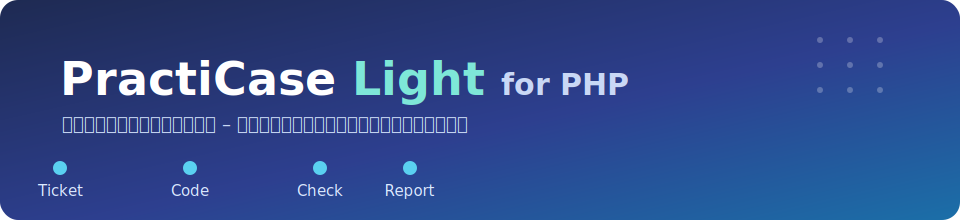

<p align="center">
  
</p>
<p align="center">
  
</p>

> A hands-on engineering training project by NULL-N — learn real-world development workflows:
> tickets, code reading, small fixes, SQL, checks, design, and reporting.

**コードを書く力を、今以上に現場で通用する力へ。**

チケットを読み、仕様を確かめ、コードを書き、設計し、SQLで調べ、報告する。
PractiCaseは、現場の仕事を一通り経験できる実務型プロジェクトです。

**PractiCase Light for PHP は、その練習用の現場です。**

NULL-N が企画・運営する実務体験型エンジニア育成教材の**入門編**で、対象は
「文法は学んだが、実務の開発経験がほとんどない人」。20本の課題で、この現場の仕事の流れを
自分の手で一周ずつ回して身につけます。一周を終えた人向けに、設計の基礎判断を鍛える
**8本の補強ドリル**、外部 API 連携の入口を体験する**3本の外部API入門**、エラーログから
障害を調査して修正まで運ぶ**2本の障害対応入門**も収録しています(全33課題)。

教材バージョン: **Light for PHP v3.0.0**

PractiCase では教材作成当初から、Redmine を使ったチケット駆動の学習環境を実装する予定でした。
v3.0.0 でその当初構想を、Redmine 6.1.3 と PostgreSQL 14.23 を Docker Compose から
自動取得・起動できる標準導線として正式に実装しました。ホストへの個別インストールは不要です。
Redmine を起動しない場合も、Markdown のチケットだけで全33課題を完走できます。
導入・運用手順は **[Redmine運用ガイド](docs/02_作業ルール/redmine-guide.md)** を参照してください。

**このファイルがオンボーディングです。** フォルダを手に入れたら、まずここを上から読んでください(5分)。

最初に読むものは、実はこの3つだけです。

1. この README(今読んでいるもの)
2. **[docs/00_はじめに/start-to-tutorial-guide.md](docs/00_はじめに/start-to-tutorial-guide.md)**
3. **[packs/php/tickets/00_はじめに/T-000_setup/ticket.md](packs/php/tickets/00_はじめに/T-000_setup/ticket.md)**

それ以外は、迷ったときや必要になったときに開けば十分です。
フォルダ構造で迷ったら **[LEARN_HERE.md](LEARN_HERE.md)** と **[docs/03_参考資料/folder-map.md](docs/03_参考資料/folder-map.md)** へ。

## 📖 これは何か

実務体験型のエンジニア育成教材です。文法問題を解くのではなく、**業務チケットを1枚ずつ最後まで運ぶ**ことで、
実務の仕事の流れを訓練します。題材は架空のITスポット案件マッチングサービス「PractiCase」。
登場する人物・企業はすべて架空です。

PractiCase Light for PHP は PractiCase シリーズの**PHP入門編**です。まず20課題で「実務の最初の一周」を
体験してもらい、一周後の任意課題として**設計基礎ドリル8課題**・**外部API入門3課題**・
**障害対応入門2課題**を用意しています(全33課題)。
より広い実務範囲を扱う本体版は、現在は一般公開していません。

## 🎫 チケットとは何か

実務の開発チームでは、仕事を口頭ではなく**チケット**という単位で受け渡します。
チケットは「仕事1件分の依頼票」で、誰からの依頼か・何が起きているか・何をすればよいか・
何をもって完了か、が書かれています(ticket = 札・整理券。仕事が1枚の札になって積まれ、
担当者が取って、状態を進めながら処理するイメージです)。
現場では Redmine や Jira、GitHub Issues などのチケット管理システムに積まれます。
この教材では、それを Markdown ファイル(各課題フォルダの `ticket.md`)で再現しています。

## 🔑 いちばん大事な考え方(ここだけは読んでから始める)

<blockquote style="border-left:4px solid #5ad1f0; margin:0; padding:4px 16px;">

1. **学習はチケットから始まります。** 課題は `packs/php/tickets/` にあり、1フォルダ = 1つの業務チケットです
2. **アプリは「直す対象」です。** ブラウザで動くアプリは完成品のサービスではなく、
   課題の症状を再現・確認するための題材です。アプリを触り込んでも学習は始まりません
3. 学習が起きる場所は、アプリの中ではなく**「チケット × エディタ × チェックコマンド」のループ**の中です

</blockquote>

**AI コード補完について**: 初回学習では、AI コード補完・生成 AI 拡張を無効にして進めることを推奨します。
この教材の目的は、あなた自身がチケットを読み、コードを探し、修正し、check で確かめる流れを体験することです
(無効化の方法: `docs/00_はじめに/setup-guide.md`)。

## 🛠️ 道具は3つ(役割を混ぜない)

| 道具 | 役割 |
|---|---|
| **エディタ(VS Code)** | チケット・仕様書・コードを読む/直す場所。**必ずこのリポジトリの一番上のフォルダを開く**(下位フォルダを開くと Ctrl+P 検索が効かなくなります) |
| **ブラウザ** | アプリの症状確認(修正前に再現し、修正後に直ったことを見る)。開く場所は `http://localhost:8180`(起動後にアクセス) |
| **ターミナル** | 起動(`docker compose up -d`)とチェック(`docker compose exec app php tools/check.php <課題ID>`) |

### ✅ 「check」とは

この教材には**提出前チェックコマンド**があり、文中では「check」と呼びます。ターミナルで

```text
docker compose exec app php tools/check.php <課題ID>
```

を実行すると、テストと変更範囲の自動検査が走り、最後に **`結果: PASS`(合格)/ `結果: FAIL`(不合格)** が
表示されます。教材の中で「check T-001 が PASS したか」とあれば、このコマンドの課題IDを変えて実行し、
PASS の表示を確認する、という意味です。

## 🚀 最初の30分でやること

1. **[docs/00_はじめに/start-to-tutorial-guide.md](docs/00_はじめに/start-to-tutorial-guide.md)** を手元に置き、導入からチュートリアル2本までを一本道で進める
   (印刷/PDF化しやすい [HTML版](docs/00_はじめに/start-to-tutorial-guide.html) もあります)
2. **[docs/00_はじめに/setup-guide.md](docs/00_はじめに/setup-guide.md)** の手順どおりに環境を作る(これ自体が最初の課題 **T-000** です)
3. `packs/php/tickets/01_チュートリアル/tutorial/ticket.md` を開き、**チュートリアル2本**で肩慣らしする
   (①1語修正で「直す流れ」を一周(30分) → ②二重ループの部品づくりで「作る流れ」を一周(40分)。
   見るべき場所が画面上で光ります)
   - VS Code のチュートリアル拡張を入れると、この2本を画面が1歩ずつ案内します(任意・おすすめ)。
     入れ方は **[START_HERE.md](START_HERE.md)** の「A」を参照
4. **[docs/00_はじめに/first-ticket-walkthrough.md](docs/00_はじめに/first-ticket-walkthrough.md)** を手元に置く
   (同じ内容の .html をブラウザで開いて印刷/PDF化してもよい。VS Code は作業に集中する)
5. `packs/php/tickets/02_開発の基礎/T-001_job_validation/ticket.md` を開く — **ここから本番の学習が始まります**

git や Pull Request の操作に不安があれば **[docs/02_作業ルール/git-and-pr-guide.md](docs/02_作業ルール/git-and-pr-guide.md)** に全手順があります
(GitHub で本物の PR を作る方式と、ローカルだけで完結する方式の両方)。
実務と同じく **GitHub Issues でチケット管理する運用**(任意・推奨 — Issue が入口、ブランチが着手宣言、PR が回答)は
**docs/02_作業ルール/workflow.md の「Issue 駆動」**へ。実務のチーム開発でよく使われる**チケット管理システム
(Redmine)を使った運用**(任意)は **[docs/02_作業ルール/redmine-guide.md](docs/02_作業ルール/redmine-guide.md)** に
起動から停止・初期化まで手順があります(やらなくても全33課題は完走できます)。

## 🗺️ 学習の地図(全33課題 = 一周20課題+補強ドリル8課題+外部API入門3課題+障害対応入門2課題)

進める順はこの1本道です(並びの意図は docs/02_作業ルール/workflow.md):

```text
T-000(環境構築) → tutorial(1語修正で「直す」を一周) → tutorial-2(部品づくりで「作る」を一周)
→ T-001(検証漏れの修正 — 最初の本番) → T-012(復習ドリル)
→ T-002(検索フィルタの修正) → T-013(復習ドリル)
→ D-010(要望整理) → D-011(基本設計) → D-012(DB設計) → D-013(詳細設計)
→ D-014(結合テスト+総合テスト仕様)
→ T-017(設計どおりに実装する)
→ T-014(SQL — DB を自分の目で見る) → T-015(GROUP BYで集計) → T-016(JOINで集計)
→ T-018(問い合わせ調査 — SQLとコード読解で切り分ける)
→ T-019(コードを直す — ログイン不具合の修正)
→ T-028(他人が書いた修正PRをレビューする — 回帰に気づく)
→ T-005(小さな仕様追加 — 仕上げ。ここまでで「実務の一周」完了)
→ D-022〜D-029(設計基礎ドリル — 一周後の任意補強章)
→ C-001〜C-003(外部API入門 — 一周後の任意補強章その2)
→ T-029 → T-031(障害対応入門 — エラーログから調査し、修正まで運ぶ。任意補強章その3)
```

前半は「簡単 → 類題 → 少し難しい」の階段です。T-012 / T-013 は直前の課題と同じ型の**復習ドリル**です。

**D-010〜D-014 はコードを書かない「設計の課題」**です。お客様の曖昧な要望(1通のメール)を、
**要望整理 → 基本設計 → DB設計 → 詳細設計 → テスト仕様**の順に、実装者へ渡せる設計書まで育てます
(題材は5課題を通して同じ1つの機能)。**T-017 で、今度は自分がその設計を読む実装者になり、設計を
コードに落とします**(設計どおりにいかない部分もあります — そこも実務です)。

**T-014〜T-016・T-018・T-019・T-028 は「SQL と保守運用」の一続きの階段**です。T-014 で DB を見る目を作り
(`SELECT`/`WHERE`/`ORDER BY`)、T-015(`GROUP BY`/`COUNT`)・T-016(`JOIN`)と技法を積み上げ、
T-018 で「実務の問い合わせに、SQL とコードの両方を読んで答える」調査課題に取り組み(コードは
直しません)、**T-019 では見つかった原因が実はコードのバグだった、という別の問い合わせに対応し、
今度は実際にコードを直します**。**T-028 では立場が逆転し、別の人が書いた「T-019 と同じ不具合を
直したPR」をレビューします。一見直っているPRが、実は別の条件を巻き込んで壊している** ——
実務で最も多い事故に、コードを書かず気づく練習です。

最後の T-005 で、再び手を動かして**「作る」(小さな仕様追加)**を経験して仕上げます。

**D-022〜D-029(06_設計基礎ドリル)は、最初の20課題で実務の一周を体験したあと、設計の判断力を
もう少し鍛えたい人向けの補強章です。**「社内メンバー管理」という小さな題材で、テーブル分け → カラム →
型 → NULL/DEFAULT → UNIQUE → PK/FK → ER図 → DDL(CREATE TABLE)という個々の判断を1つずつ
素振りします(コードは書きません)。取り組みは任意です — D-012(DB設計)で通った判断を
もう一段確実にしたくなったら開いてください。

**C-001〜C-003(07_外部API入門)は、自分のアプリの「外」にあるサービスと連携する最初の一歩です。**
教材内で完結するローカルの通知基盤 PCP(架空のクラウドAPI)を相手に、「仕様を読む → API を呼ぶ →
返ってきた結果と残った記録を確かめる → 報告する」という外部 API 連携の基本動作を、
正常系(C-001)→ 認証エラー 401(C-002)→ 権限エラー 403(C-003)の順で体験します(コードは書きません)。
`docker compose up -d` でアプリと一緒に PCP のコンテナも起動します(コンテナが2つ動きますが、
操作コマンドは今までと同じです。PCP はホストへポートを公開せず、外部への通信も一切ありません)。
取り組みは任意です — 現場で外部 API や Webhook、SaaS 連携に触れる前の型作りとして開いてください。
各課題の仕様書にある「画面での観察(任意)」(admin の API 監査ログ画面)は、
T-019 の修正を終えた環境で使えます。観察は補助なので、できなくても3課題とも最後まで進められます。

**T-029・T-031(08_障害対応入門)は、本番で障害が起きたときの一連の動き — エラーログから
事実を確定し、修正まで運ぶ — を体験する補強章その3です。**「承認ボタンで500エラーになる」という
問い合わせを受けて、T-029 では保全されたエラーログをターミナル(`grep` / `tail`)で絞り込み、
いつ・どこで・誰に・何が・何回起きたのかを特定して、機械が確認できる形式の報告書にまとめます
(**T-029 ではコードを直しません** — 「原因が分かってもすぐ直さない」が実務の型です)。
**T-031 では自分の調査報告を受けて実際に修正します。** 例外が発生した場所と欠陥がある場所は
別だった — その区別を、最小の修正と回帰確認で締めくくります。T-018 の調査経験が土台になるので、
T-018 のあとならいつでも取り組めます。

## 🗂️ 何がどこにあるか(いつ読むか)

| 場所 | 中身 | いつ読む・使う |
|---|---|---|
| `packs/php/tickets/` | 課題(業務チケット)。学習の起点 | 常に |
| `LEARN_HERE.md` | 学習者用の入口。最初に見る場所だけを整理 | 迷ったとき |
| `docs/03_参考資料/folder-map.md` | フォルダ構造の地図 | フォルダの役割が分からないとき |
| `docs/00_はじめに/first-ticket-walkthrough.md` | 課題の進め方の完全ガイド(印刷用 .html あり) | T-001 の前に。以降も手元に |
| `docs/00_はじめに/start-to-tutorial-guide.md` | 導入から tutorial-2 完了までの一本道(印刷用 .html あり) | 最初の1回 |
| `docs/03_参考資料/code-tour.md` | コードの歩き方(構造の地図・用語辞書) | コードで迷子になったら |
| `docs/00_はじめに/setup-guide.md` | 環境構築の手順 | 最初の1回 |
| `docs/02_作業ルール/workflow.md` | チケット運用の詳細ルール(ブランチ・status) | T-000 が終わる頃に一読 |
| `docs/02_作業ルール/redmine-guide.md` | Redmine を使ったチケット駆動運用の手順(任意) | Redmine を使ってみたくなったら |
| `docs/01_設計資料/` | **設計書一式**(下の「設計資料」参照) | チケットが参照を指したとき。全体像を先に把握したいときも |
| `docs/03_参考資料/world.md` | 登場人物と世界観(ログイン情報の名簿もここ) | 最初に一度 |
| `packs/php/app/` | アプリのコード本体(public=画面 / src=ロジック / tests=テスト) | 課題の調査・修正対象 |
| `packs/php/sql/` | SQL課題の提出ファイル | T-014・T-015・T-016・T-018 で SQL を書くとき |
| `reports/` | あなたの報告書・振り返りの置き場 | 課題の提出物を書くとき |

## 📐 設計資料(このシステムの設計書)

PractiCase は「既存の業務システムを引き継ぐ」設定です。実務と同じく、コードの前に**設計書**があります。

**読み方(大事)**: 設計資料は**最初から全部読む必要はありません**。分量が多いので、通読しようとすると疲れて終わります。
**チケットや walkthrough が「ここを見ろ」と参照した箇所だけ**開くのが正しい使い方です。
目安として、T-001 では主に features.md の **F-02** を見ます。以降の課題でも、support/spec.md が指す番号だけを開けば足ります。

| 資料 | ファイル | 中身 |
|---|---|---|
| 機能仕様書 | [docs/01_設計資料/features.md](docs/01_設計資料/features.md) | 各機能の仕様(F-01〜)。課題の「あるべき姿」の正 |
| テーブル定義書 / DB設計 | [docs/01_設計資料/database.md](docs/01_設計資料/database.md) | 全テーブルのカラム・型・制約、ER図、状態遷移図 |
| 画面設計・画面遷移図 | [docs/01_設計資料/screens.md](docs/01_設計資料/screens.md) | 全画面の一覧、権限マトリクス、画面遷移図 |
| コーディング規約 | [docs/02_作業ルール/coding-rules.md](docs/02_作業ルール/coding-rules.md) | 実装とレビューの判断基準(SEC/ARC など) |

(図は Markdown の **Mermaid 記法**で描かれています。**GitHub 上で開くと図として表示**され、
VS Code では拡張機能(Markdown Preview Mermaid Support)を入れると図に、無くても**コードブロックとしてそのまま読めます**)

## ⚠️ よくある勘違い(先に潰しておきます)

- 「アプリの画面の中でコードを直すのでは?」→ **直すのはエディタ(VS Code)**。アプリは確認だけ。差分は git diff / Pull Request で見ます
- 「Ctrl+P でファイルが見つからない」→ VS Code で開いているのが下位フォルダです。**一番上のフォルダを開き直す**
- 「先にアプリを全部触ってから始める?」→ 触り込む必要はありません。チケットが指示したときに、指示された場所を触ります
- 「教材のファイル(ticket.md)を書き換えていいの?」→ **チケットと reports/ は書き換えるためのファイル**です。
  status の運用(open → in_progress → resolved → closed)も、ticket.md 先頭の front matter を自分で編集して行います
- 「このアプリを自分のサーバで公開してもいい?」→ **公開しないでください**。このアプリは学習用に
  **意図的なバグを含んでいます**。自分の PC の中だけで動かします(既定で 127.0.0.1 からしか
  アクセスできない設定です)

## 📦 このリポジトリについて(Repository & Contribution Policy)

This repository is maintained by NULL-N.
For learning, please fork or use this repository as a template and work in your own copy.
**External pull requests are not part of the official workflow at this stage.**
If issues are enabled, they are used for feedback and reports only —
changes are reviewed, selected, and implemented by NULL-N.

学習は**自分のコピーの中で**行います。コピーはあなたのものなので、壊しても誰にも影響しません
(DB は `docker compose exec app php tools/init-db.php` で何度でも作り直せます)。
この教材は **GitHub の利用を前提**とします(すべて無料枠の範囲。現場と同じく GitHub でコード・PR・
レビュー・CI を回す体験がこの教材の核だからです)。GitHub Actions が push / PR ごとに共通テストを
自動実行します。オフライン等で GitHub を使えない場合の ZIP 方式も残していますが非推奨です
(詳細は setup-guide.md)。**有料サービス・外部 API は一切使いません**。

外部からの Pull Request は、現時点では公式の運用に含めていません。
Issue(有効にしている場合)は**フィードバックと不具合報告の窓口**で、
修正の判断と実装は NULL-N が行います。

## ✍️ 著作・運営について(Authorship)

NULL-N PractiCase is planned, directed, reviewed, and maintained by **NULL-N**.

本教材は、NULL-N が企画・設計方針・教材方針・要件判断・品質判断・公開判断を行っています。
実装や文書作成の一部では AI ツールを補助的に利用していますが、プロジェクトの方向性・学習設計・
採否判断・品質基準・運営方針は NULL-N が決定しています(詳細: **[docs/03_参考資料/about.md](docs/03_参考資料/about.md)**)。

## 🤝 利用条件への同意

本プロジェクトを利用(複製、実行、編集を含む)した時点で、利用者(企業・団体を含む)は
本利用条件に同意したものとみなします。
同意できない場合は、本プロジェクトを利用しないでください。

## 📄 License / 利用条件

本プロジェクトの著作権・その他一切の権利は NULL-N に帰属します。学習・研修目的(企業・団体を含む)
での実行・閲覧・手元コピーの編集を許可しますが、再配布・改変版の公開・派生教材や派生サービスの提供・
商用利用・著作表示の削除は、NULL-N の明示的な許可なく行えません。AI ツールを用いた改変・再構成も
この制限の対象です。

**詳しい利用条件・準拠法は [TERMS.md](TERMS.md) を参照してください。**

Copyright (c) 2026 NULL-N. All rights reserved.
