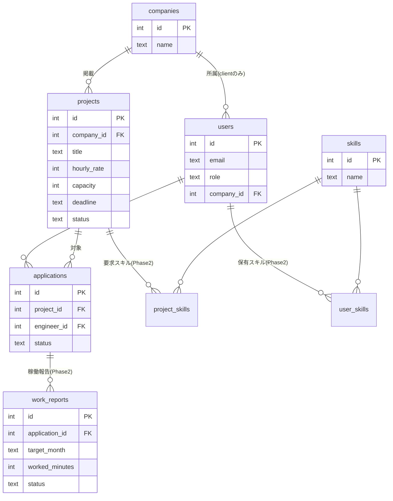
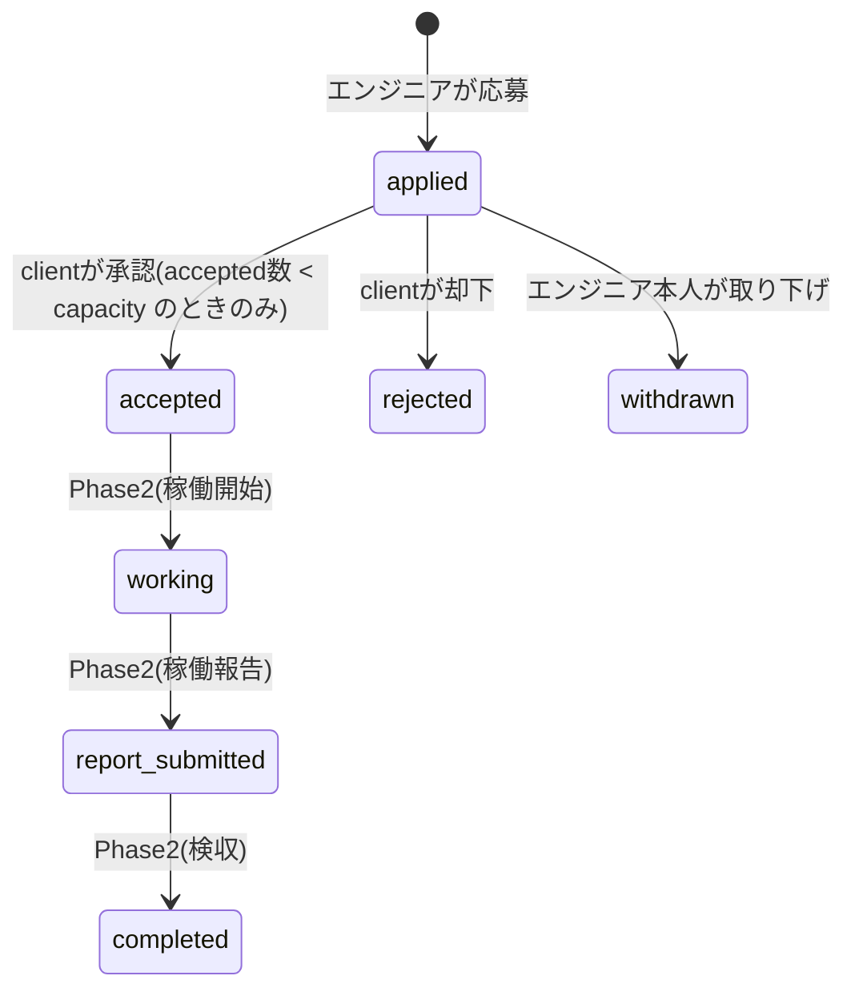

# PractiCase DB設計書

対象: ITスポット案件マッチングシステム「PractiCase」
DB: SQLite 3(1ファイル。`packs/php/app/database/practicase.db` に生成)

この文書は全体設計を示す。**MVP(Phase 1)で実装する範囲**と、**Phase 2 以降に回す範囲**をテーブルごとに明記する。

---

## 1. 設計方針

| # | 方針 | 理由 |
|---|---|---|
| D-1 | 日時は TEXT で ISO 8601(`YYYY-MM-DD HH:MM:SS`)、日付のみは `YYYY-MM-DD` | SQLite に日時型がないため表現を統一する |
| D-2 | 日時の生成はアプリ層(PHP、タイムゾーン Asia/Tokyo)で行い、SQL の `datetime('now')` に頼らない | SQLite の `now` は UTC。生成箇所を PHP に一元化して時刻のズレを防ぐ |
| D-3 | 金額は円単位の INTEGER で保持する | 浮動小数の誤差を避ける |
| D-4 | 入力値の検証はアプリケーション層で一元管理し、DB 制約は NOT NULL / UNIQUE / FK のみとする | 検証ルールとエラーメッセージを 1 箇所(バリデータ)で管理するため。CHECK 制約は使わない。※本番設計では CHECK 等の DB 制約を重ねる多層防御も標準的な検討対象(coding-rules.md の補足を参照) |
| D-5 | 外部キーは必ず定義し、接続時に `PRAGMA foreign_keys = ON` を実行する | SQLite は既定で FK 無効のため明示する |
| D-6 | 削除は原則行わない(status による論理制御)。物理 DELETE は使わない | 業務データの履歴を壊さない。実務の一般則に合わせる |
| D-7 | 主キーは `id INTEGER PRIMARY KEY AUTOINCREMENT` | 単純・可読優先 |

---

## 2. ER図(全体)

実装範囲: `companies` `users` `projects` `applications` = **MVP**、`work_reports` `skills` `project_skills` `user_skills` = **Phase 2**。

---

## 3. MVPテーブル定義(Phase 1 で実装)

### 3.1 companies — クライアント企業

| カラム | 型 | 制約 | 説明 |
|---|---|---|---|
| id | INTEGER | PK AUTOINCREMENT | |
| name | TEXT | NOT NULL | 企業名(100文字以内 ※検証はアプリ層、以下同) |
| contact_email | TEXT | NOT NULL | 代表連絡先 |
| created_at | TEXT | NOT NULL | |
| updated_at | TEXT | NOT NULL | |

### 3.2 users — 利用者(全ロール共通)

| カラム | 型 | 制約 | 説明 |
|---|---|---|---|
| id | INTEGER | PK AUTOINCREMENT | |
| name | TEXT | NOT NULL | 表示名 |
| email | TEXT | NOT NULL UNIQUE | ログインID |
| password_hash | TEXT | NOT NULL | `password_hash()` の結果のみ格納 |
| role | TEXT | NOT NULL | `engineer` / `client` / `admin` |
| company_id | INTEGER | NULL, FK→companies.id | client のみ設定。engineer / admin は NULL |
| status | TEXT | NOT NULL DEFAULT 'active' | `active` / `suspended`(停止中はログイン不可) |
| created_at | TEXT | NOT NULL | |
| updated_at | TEXT | NOT NULL | |

### 3.3 projects — 案件

| カラム | 型 | 制約 | 説明 |
|---|---|---|---|
| id | INTEGER | PK AUTOINCREMENT | |
| company_id | INTEGER | NOT NULL, FK→companies.id | 掲載企業 |
| title | TEXT | NOT NULL | 案件名(100文字以内) |
| description | TEXT | NOT NULL | 案件内容(2000文字以内) |
| hourly_rate | INTEGER | NOT NULL | 時間単価(円)。1〜100,000 |
| capacity | INTEGER | NOT NULL | 募集人数 = **承認(accepted)数の上限**。1〜100 |
| deadline | TEXT | NOT NULL | 応募締切日 `YYYY-MM-DD`。**当日 23:59:59 まで応募可** |
| work_start_on | TEXT | NOT NULL | 稼働開始日 `YYYY-MM-DD`。deadline 以降 |
| is_remote | INTEGER | NOT NULL DEFAULT 0 | リモート可 = 1 / 不可 = 0 |
| status | TEXT | NOT NULL DEFAULT 'open' | `draft` / `open` / `closed` |
| created_at | TEXT | NOT NULL | |
| updated_at | TEXT | NOT NULL | |

status 遷移: `draft`(下書き・非公開)→ `open`(公開中)→ `closed`(掲載終了)。MVP の登録画面は `open` で直接作成し、`draft` は将来の下書き保存用に予約する。`closed` への変更は掲載企業(client)本人のみ(admin による強制終了は Phase 2 で検討)。

### 3.4 applications — 応募

| カラム | 型 | 制約 | 説明 |
|---|---|---|---|
| id | INTEGER | PK AUTOINCREMENT | |
| project_id | INTEGER | NOT NULL, FK→projects.id | |
| engineer_id | INTEGER | NOT NULL, FK→users.id | role=engineer のユーザー |
| message | TEXT | NOT NULL DEFAULT '' | 応募メッセージ(500文字以内・任意) |
| status | TEXT | NOT NULL DEFAULT 'applied' | 下記の状態遷移を参照 |
| applied_at | TEXT | NOT NULL | 応募日時 |
| decided_at | TEXT | NULL | 承認/却下の確定日時 |
| created_at | TEXT | NOT NULL | |
| updated_at | TEXT | NOT NULL | |

複合ユニーク: `UNIQUE(project_id, engineer_id)` — 同一案件への応募は1人1回。**取り下げ(withdrawn)後の再応募もできない**(仕様として固定。F-05 参照)。

#### applications.status の状態遷移

MVP で扱う状態: `applied` / `accepted` / `rejected` / `withdrawn`。決定後(accepted / rejected / withdrawn)の状態変更は MVP では不可。

---

## 4. Phase 2 テーブル定義(設計のみ・MVPでは実装しない)

### 4.1 skills / project_skills / user_skills — スキル(多対多)

| テーブル | カラム | 説明 |
|---|---|---|
| skills | id, name(UNIQUE) | スキルマスタ(例: PHP, MySQL, Docker) |
| project_skills | project_id FK, skill_id FK, is_required | 案件の要求スキル。is_required: 必須=1 / 歓迎=0 |
| user_skills | user_id FK, skill_id FK, years | エンジニアの保有スキルと経験年数 |

project_skills / user_skills は複合主キー(`(project_id, skill_id)` / `(user_id, skill_id)`)。

### 4.2 work_reports — 稼働報告(精算の元データ)

| カラム | 型 | 説明 |
|---|---|---|
| id | INTEGER PK | |
| application_id | INTEGER NOT NULL FK | accepted な応募に紐づく |
| target_month | TEXT NOT NULL | 対象月 `YYYY-MM` |
| worked_minutes | INTEGER NOT NULL | 稼働時間(**分単位の整数**) |
| amount | INTEGER NULL | 精算額(円)。検収確定時に計算して保存 |
| status | TEXT NOT NULL | `submitted` / `remanded`(差し戻し) / `approved`(検収済) |
| submitted_at / approved_at | TEXT | |
| created_at / updated_at | TEXT | |

複合ユニーク: `UNIQUE(application_id, target_month)` — 同一応募・同一月の報告は1件。

設計メモ:
- 稼働時間を「分の整数」で持つのは D-3 と同じ理由(0.5h 等の小数を避ける)。表示時に h へ変換する。
- 精算幅(月140h〜180h: 下回ると控除・超えると超過支給)は Phase 2 で projects に `settlement_min_hours` / `settlement_max_hours` を追加して対応する。精算計算ロジックは 1 クラスに集約し、**月跨ぎ・境界値(139h/140h/180h/181h)を教材の中心にする**。

---

## 5. インデックス(MVP)

| 対象 | 目的 |
|---|---|
| `applications(project_id, engineer_id)` UNIQUE | 二重応募防止(定義済み) |
| `applications(project_id, status)` | 応募者一覧・accepted 数カウント |
| `projects(status, deadline)` | 案件検索(公開中+締切前) |
| `users(email)` UNIQUE | ログイン(定義済み) |

データ量は教材規模(数百行)のため、これ以上のチューニングは行わない。

---

## 6. スキーマ・シードの管理

| ファイル | 内容 |
|---|---|
| `packs/php/app/database/schema.sql` | 全 CREATE TABLE / CREATE INDEX(MVP テーブルのみ。Phase 2 テーブルは Phase 2 で追加) |
| `packs/php/app/database/seeds.php` | 初期データ定義(admin 1、client 2社/2名、engineer 3名、案件 6件、応募 4状態)。ユーザー投入はパスワードハッシュ生成が必要なため PHP 配列で定義し、`tools/init-db.php` が適用する。日付は基準日からの相対で生成し、実行日に依存して壊れないようにする(ARC-5) |
| DB 実体(*.db) | **コミットしない**(.gitignore 済)。セットアップ時に `tools/init-db.php` が schema.sql + seeds.php から生成する |

マイグレーションツールは使わない(素朴さ・可読性優先)。スキーマ変更時は schema.sql を更新し、DB を作り直す運用とする。

シードデータの人物・企業名は `docs/03_参考資料/world.md` の登場人物に合わせる。
