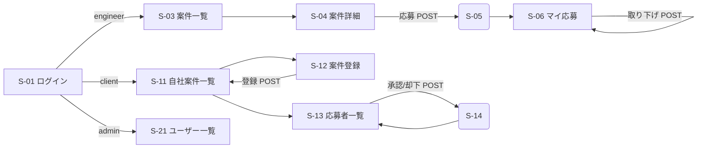

# PractiCase 画面設計書(MVP / Level 1〜3)

対象は MVP で実装する画面のみ。稼働報告・検収・精算(Phase 2)の画面は含まない。

---

## 1. ルーティング方針

- フレームワークは使わず、**URL = public/ 配下の PHP ファイル**とする(ページコントローラ型)。
- 各ページは薄い入口に徹し、検証・DB操作・業務ルールは `src/` のクラスへ寄せる(詳細は `docs/02_作業ルール/coding-rules.md` ARC 系ルール)。
- 更新系は必ず POST(+CSRFトークン)。GET は参照のみ。

## 2. 画面一覧

| ID | URL | 画面名 | 主な利用ロール |
|---|---|---|---|
| S-00 | /index.php | ホーム(ロール別の入口と概況) | ログイン済み全ロール |
| S-01 | /login.php | ログイン | 全員(未ログイン) |
| S-02 | /logout.php | ログアウト(POST のみ・画面なし) | ログイン済み全ロール |
| S-03 | /projects/index.php | 案件一覧・検索 | engineer, admin |
| S-04 | /projects/show.php?id={id} | 案件詳細(応募フォーム含む) | engineer, admin, client(自社分) |
| S-05 | /applications/create.php | 応募実行(POST のみ・画面なし) | engineer |
| S-06 | /applications/mine.php | マイ応募一覧(取り下げ操作含む) | engineer |
| S-11 | /client/projects.php | 自社案件一覧 | client |
| S-12 | /client/project_new.php | 案件登録(フォーム+POST) | client |
| S-13 | /client/applications.php?project_id={id} | 応募者一覧(承認/却下操作含む) | client |
| S-14 | /client/application_decide.php | 承認/却下実行(POST のみ・画面なし) | client |
| S-21 | /admin/users.php | ユーザー一覧(停止/再開操作含む) | admin |

画面を持つのは 8(S-01, S-03, S-04, S-06, S-11, S-12, S-13, S-21)。S-02 / S-05 / S-14 は POST 専用の処理エンドポイント。

## 3. 権限マトリクス

○ = 利用可 / ✕ = 不可(未ログインは S-01 へリダイレクト、ロール外・他社リソースは 404)

| 画面 | 未ログイン | engineer | client | admin |
|---|---|---|---|---|
| S-01 ログイン | ○ | ○(トップへ) | ○(トップへ) | ○(トップへ) |
| S-03 案件一覧 | ✕ | ○(open+締切前のみ) | ✕ | ○(全件・全status) |
| S-04 案件詳細 | ✕ | ○(open のみ) | ○(**自社のみ**) | ○(全件) |
| S-05 応募実行 | ✕ | ○ | ✕ | ✕ |
| S-06 マイ応募 | ✕ | ○(自分の分のみ) | ✕ | ✕ |
| S-11 自社案件一覧 | ✕ | ✕ | ○(自社のみ) | ✕ |
| S-12 案件登録 | ✕ | ✕ | ○ | ✕ |
| S-13 応募者一覧 | ✕ | ✕ | ○(**自社案件のみ**) | ✕ |
| S-14 承認/却下 | ✕ | ✕ | ○(自社案件のみ) | ✕ |
| S-21 ユーザー一覧 | ✕ | ✕ | ✕ | ○ |

この表は権限観点の正とする。「自社のみ」「自分の分のみ」の行は、**URL の id を書き換えた直接アクセス(他社・他人のリソース参照)でも 404 になること**を含む。

## 4. 画面遷移図

ログイン後は共通ホーム(S-00)へ遷移し、ロール別の主要アクションから各画面へ進む。

## 5. 各画面の構成要素(要点)

### S-01 ログイン

- 入力: email、password。失敗時は「メールアドレスまたはパスワードが正しくありません」(どちらが誤りかは示さない)。
- 停止中(suspended)ユーザーは正しい資格情報でも同じ文言で拒否する。

### S-03 案件一覧・検索

- 検索フォーム: キーワード(1入力欄)、「リモート可のみ」チェックボックス。
- 一覧項目: 案件名/企業名/時間単価/稼働開始日/応募締切/リモート可否。締切が近い順。最大50件。
- 0件時: 「条件に合う案件はありません」を表示(空白のままにしない)。

### S-04 案件詳細

- 表示: 案件の全項目+企業名。
- engineer には応募フォーム(message 500文字以内)を表示。ただし応募済み/締切超過/募集終了(closed)の場合はフォームの代わりに理由を表示する。

### S-06 マイ応募一覧

- 一覧項目: 案件名/企業名/応募日時/状態(applied=選考中、accepted=承認、rejected=見送り、withdrawn=取り下げ)。
- applied の行にのみ「取り下げ」ボタン(POST、確認ダイアログ付き)。

### S-11 自社案件一覧

- 一覧項目: 案件名/状態/締切/応募数(累計)/承認数/募集人数。「応募者を見る」で S-13 へ。
- 「掲載終了」ボタン(open → closed、POST)。

### S-12 案件登録

- 入力項目と検証は機能仕様書 F-02 に従う。エラー時は入力値を保持して全エラーを一括表示する。

### S-13 応募者一覧

- 対象案件のヘッダ(案件名/承認数/募集人数)+応募一覧(応募者名/応募日時/message/状態)。
- applied の行にのみ「承認」「却下」ボタン(POST)。承認数が募集人数に達している場合、承認ボタンは押せてもサーバ側で拒否する(F-07)。

### S-21 ユーザー一覧

- 一覧項目: 名前/email/ロール/状態。active 行に「停止」、suspended 行に「再開」ボタン(POST)。admin 自身は停止できない。

## 6. 共通UI

- ヘッダ: サービス名/ログイン中ユーザー名(ロール表示付き)/ログアウトボタン(POST)。
- フラッシュメッセージ: 更新系処理の結果(成功=緑/失敗=赤)をリダイレクト後に1回だけ表示する。
- すべての動的出力は `htmlspecialchars()` を通す(SEC-2)。
- 更新系フォームには CSRF トークンを埋め込む(SEC-5)。
- ページングは MVP では実装しない(50件上限で代替)。
