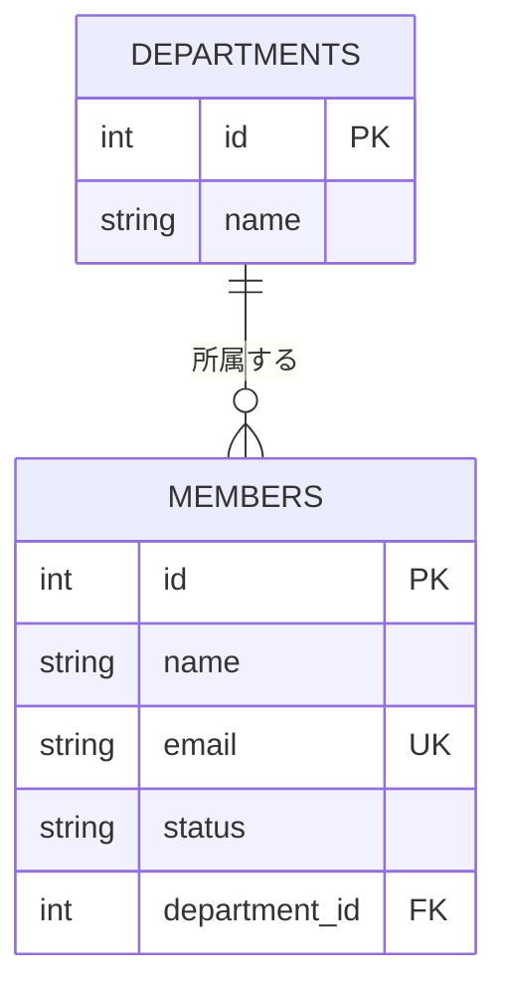

# D-028 突き合わせ(模範との比較)

自分の `reports/D-028_er_diagram.md` と見比べてください。**見た目のレイアウトや
細かい表記が違っても構いません** — 「部署1・メンバー多」の関係と、PK/FK/UKの位置が
正しく読み取れれば、この課題の目的は達成しています。

## 模範の内容(1つの妥当な例)

````markdown

````

## 別解について

- 関連線のラベル(`"所属する"`)の文言は自由です
- `int`/`string`のような型表記は、D-024で決めた自分の型表記に合わせて構いません
- `left_at`(退職日、D-025で追加した場合)のような追加カラムを図に含めても構いません

## 見つかりやすい抜け

- **関連線の向きを逆にしてしまう**: `MEMBERS ||--o{ DEPARTMENTS`のように書くと、
  「1人のメンバーに対して複数の部署」という逆の意味になってしまいます。
  「1」の記号(`||`)がどちらのエンティティに付いているかを確認してください
- **UKやFKの付け忘れ**: PKだけ付けて、メールの`UK`や部署参照の`FK`を忘れるケース。
  D-026・D-027で決めた判断を、そのまま図に反映できているか見直してください
- **コードブロックの中に説明文を書いてしまう**: 「これは部署とメンバーの関係を
  表す図です」のような文章がコードブロックの中に混ざると、正しいMermaidとして
  認識されません

## この課題で本当に鍛えたいこと

文章で考えた設計を、他人が一目で理解できる図に変換する力です。実務では、
文章の設計書だけでなくER図を合わせて示すことで、レビューする人・実装する人の
理解が大きく速くなります。
