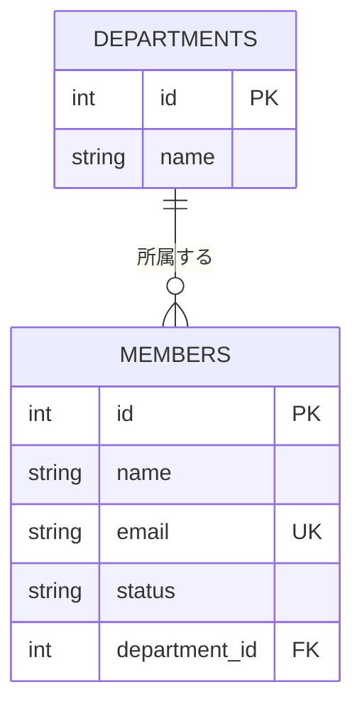

# D-028 spec: ER図メモの型

## 提出物の型(reports/D-028_er_diagram.md)

この型をそのまま使ってください。エンティティ名は英大文字(`DEPARTMENTS`・`MEMBERS`)を
推奨しますが、これまで使ってきたテーブル名が分かる名前であれば構いません。

````markdown
# D-028 ER図

## テーブルの関係図


````

## Mermaid ER図の読み方

- `A ||--o{ B : ラベル`: Aは1、Bは多(1対多)を表す。`||`が「ちょうど1」、`o{`が
  「0以上(多)」を表す記号。今回は部署側が`||`、メンバー側が`o{`になります
- `{ }`の中の各行: `型 カラム名 [PK|FK|UK]` の形。`PK`は主キー、`FK`は外部キー、
  `UK`はUNIQUE(一意制約)を表します
- コードブロック(` ```mermaid `〜` ``` `)の中には、Mermaidの記法だけを書いてください。
  「ここでは〜を表します」のような説明文は、コードブロックの**外側**(前後)に書きます

## 決めなくてよいこと

- CREATE TABLE文(DDL。D-029の仕事)
- コード(この章では一切書かない)

## 表記の自由

- エンティティ名・型名(`int`/`INTEGER`等)の細かい表記ゆれは自由です
- 関連線のラベル(`"所属する"`の部分)の文言は自由です
